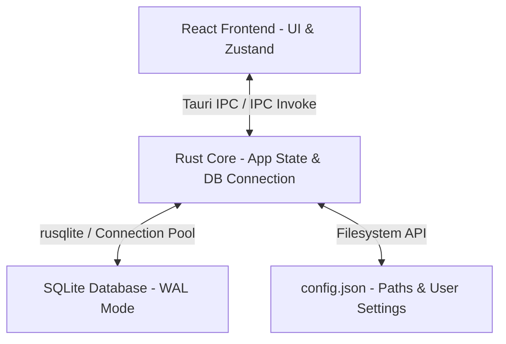
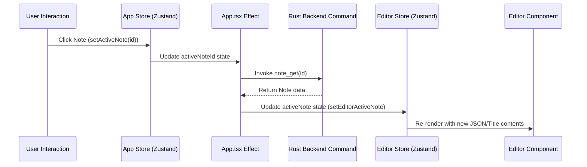

# Notesy Note - Detailed System Implementation Document

Notesy Note is a high-performance, local-first note-taking application designed for speed, flexibility, and absolute data privacy. It leverages Tauri for a lightweight desktop footprint, React with TypeScript for a modern, fluid user interface, and SQLite (via rusqlite) for efficient, robust local storage.

This document provides a line-by-line detailed overview of the application architecture, database schema design, Rust command handlers, state management configurations, filesystem setups, and client-server synchronization flows.

---

## 1. Architectural Topology

The application follows a traditional hybrid desktop architecture. The frontend acts as a rendering and state tracking layer, while the Rust backend operates as a secure database controller and operating system bridge.



### 1.1 Core Subsystems

1. **Frontend Presentation**: Responsible for capturing user input, rendering note list trees, drawing rich-text editors, displaying tag controls, and triggering search modals.
2. **Tauri IPC Command Interface**: Acts as the communication bridge. Invokes native Rust methods for file operations, database queries, search executions, and settings configurations.
3. **Rust Application State**: Manages active SQLite connections, configures database relocation, and manages temporary database state securely across multiple system threads.
4. **SQLite Storage Engine**: Uses a single file database with Write-Ahead Logging (WAL) enabled to support concurrent read and write operations without interface freezing.

---

## 2. Database Schema and Storage

The relational database is initialized and managed by the Rust core at application startup. The migration script 001_init.sql configures the relational tables, foreign key constraints, search triggers, and virtual tables.

### 2.1 Table Definitions and Columns

- **`folders`**: Stores folder structures allowing nested tree navigation. Columns include `id` (UUID string), `name` (folder name), `parent_id` (nested hierarchy key referencing folders), `sort_order` (sorting index), `created_at` (millisecond timestamp), and `updated_at` (last modified timestamp).
- **`notes`**: The central repository of notes. Columns include `id` (UUID), `title` (text heading), `content_json` (serialized TipTap document JSON), `content_text` (raw plain text for indexing), `folder_id` (references folders), `is_favorite` (boolean state flag), `is_deleted` (trash state flag), `embedding` (vector BLOB for AI search), `embedding_model` (model string), `created_at` (epoch timestamp), and `updated_at` (epoch timestamp).
- **`tags`**: Stores unique tags with custom hex color values. Columns include `id` (UUID), `name` (unique label text), and `color` (hex string default '#6b7280').
- **`note_tags`**: Joins notes and tags with a primary key constraint of `(note_id, tag_id)` and cascade deletion rules on both columns to prevent orphaned references.
- **`assets`**: Stores binary attachments (images, PDF documents, files) embedded in notes. Columns include `id` (UUID), `note_id` (owning note reference), `filename` (original file name), `mime_type` (file type identifier), `data` (binary BLOB containing the actual file data), and `created_at` (epoch timestamp).
- **`note_history`**: Stores automatic periodic snapshots of note content for version history. Columns include `id` (UUID), `note_id` (referencing notes), `content_json` (Tiptap document state snapshot), and `saved_at` (epoch timestamp).
- **`note_links`**: Stores internal wiki-links between notes for bi-directional linking. Columns include `source_note_id` (origin note reference) and `target_note_id` (target note reference).

### 2.2 Full-Text Search (FTS5) & Triggers

The application implements SQLite's FTS5 extension to provide search functionality across note titles and content text. A virtual table `notes_fts` is configured as follows:

```sql
CREATE VIRTUAL TABLE IF NOT EXISTS notes_fts USING fts5 (
    title,
    content_text,
    content='notes',
    content_rowid='rowid'
);
```

To ensure that search data remains in sync with the primary `notes` table, three database triggers are defined:

- **`notes_ai`**: Fires after an `INSERT` command on `notes`, writing the new `rowid`, `title`, and `content_text` into `notes_fts`.
- **`notes_au`**: Fires after an `UPDATE` command on `notes`, deleting the old FTS entry and inserting the updated content values.
- **`notes_ad`**: Fires after a `DELETE` command on `notes`, removing the corresponding FTS entry to prevent stale search hits.

---

## 3. Rust Backend & Tauri IPC Commands

The backend is structured into modular commands located within `src-tauri/src/commands/`. These functions are annotated with `#[tauri::command]` and registered inside `lib.rs`.

### 3.1 Notes Operations

- `note_create`: Generates a new Note record with an auto-generated UUID, current timestamp, and empty paragraph JSON content.
- `note_update`: Updates note fields (`title`, `content_json`, `content_text`, `updated_at`). Evaluates if a history snapshot needs to be saved.
- `note_get`: Retrieves a single Note record from the database by ID and maps the `is_favorite` and `is_deleted` integers to TypeScript booleans.
- `notes_list`: Returns notes for a specific folder. Resolves root notes if the passed folder ID is null, filtering out deleted notes.
- `note_delete`: Moves a note to the Trash folder by setting the `is_deleted` flag to `1` without destroying the actual database row.
- `note_restore`: Recovers a note from the Trash folder by resetting the `is_deleted` flag to `0`, making it visible again in its parent folder.
- `note_toggle_favorite`: Inverts the current boolean state of the `is_favorite` flag in the SQLite database and returns the new value.
- `note_move_to_folder`: Updates the target note's `folder_id` foreign key attribute, allowing users to drag and drop notes between folders.

### 3.2 Auto-Snapshotting Engine

During execution of `note_update`, a version history engine runs automatically. It queries the `note_history` table for the most recent snapshot:

```rust
let last_snapshot_time: Option<i64> = conn.query_row(
    "SELECT saved_at FROM note_history WHERE note_id = ?1 ORDER BY saved_at DESC LIMIT 1",
    [&id],
    |row| row.get(0),
).optional().unwrap_or(None).flatten();
```

If the duration between the current update timestamp and the last snapshot timestamp exceeds 10 minutes (600,000 milliseconds), or if no historical snapshots exist for this note, a new record containing the current Tiptap document state is appended to the database.

---

## 4. Frontend State Architecture

The client uses React with Zustand for state management. This decoupled approach prevents unnecessary re-renders of the sidebar and editor components.

### 4.1 UI and Application Store

The `useAppStore` in [appStore.ts](file:///c:/Products-Projects/Noetesy%20Note/notesy-note/src/stores/appStore.ts) maintains parameters shared across the application interface:

- **`activeNoteId`**: The currently focused note. Triggers content fetch inside React `useEffect` hooks when modified.
- **`activeFolderId`**: Determines which notes are rendered in the notes list pane. Sets active note to null when switching folders.
- **`notes`, `folders`, `tags`**: Cached arrays fetched from backend to support instant client-side rendering.
- **`isSearchOpen`**: Tracks the open/closed visibility state of the Command+K search modal interface.
- **`isDarkMode`**: Boolean tracking the theme. Adds/removes the `dark` class from the root document element.
- **`editorFont`**: Renders custom fonts ('sans', 'calibri', 'comicsans', 'helvetica', 'times', 'aptos') persisted via localStorage.

### 4.2 Editor Document Store

The `useEditorStore` in [editorStore.ts](file:///c:/Products-Projects/Noetesy%20Note/notesy-note/src/stores/editorStore.ts) handles the active editor buffer:

- **`activeNote`**: The complete `Note` record containing JSON content, title, and timestamp metadata.
- **`noteTags`**: The collection of tags currently assigned to the open note.
- **`isSaving`**: Tracks whether an asynchronous save operation is active to show saving indicators in the editor status bar.
- **`lastSavedAt`**: A timestamp indicating the last successful database update.
- **`wordCount`**: Tracked via text segmentation algorithms running in real-time on the client editor change handler.

---

## 5. Note Switching and Content Loading Flow

The note switching process is designed to be atomic and responsive. It operates through synchronized hooks between the stores and backend:



This lifecycle ensures that heading updates and document editor hydration happen sequentially, avoiding inconsistencies where note content does not match the active heading.

---

## 6. Filesystem Management & Config Redirection

Notesy Note operates under a local-first paradigm, allowing users to direct where their database is stored on the system filesystem.

### 6.1 Configuration Resolution

- The app resolves its configuration directory using Tauri's built-in `app_config_dir()` path utility.
- Inside this directory, `config.json` stores the user's customized database directory path `database_dir`.
- If `database_dir` is undefined, the application defaults to resolving the SQLite database inside `app_data_dir()`.

### 6.2 Relocation Process

When a user selects a new database location via the settings view:
1. The path string is passed to `set_database_path`.
2. The Tauri backend invokes `Database::change_path()`, which instantiates a new rusqlite connection to the target folder.
3. Migrations are executed on the new target database file to ensure it matches the schema.
4. The backend acquires a mutex lock on the old connection instance and swaps it with the newly created connection pointer.
5. The updated path string is written back to `config.json` for persistence across system reboots.

---

## 7. Performance Optimizations

1. **WAL Mode Execution**: Configuring the journal mode to Write-Ahead Logging allows background index writing while maintaining read operations on the frontend UI threads.
2. **Atomic JSON Payloads**: Text content and document structured trees are serialized directly into strings, minimizing the payload size across Tauri's serialization boundary.
3. **Debounced Auto-Save**: Editor keystrokes trigger a debounced save handler. This buffers writes and prevents rapid database updates.
4. **FTS Matching**: Using MATCH syntax within the virtual search table allows high-speed content lookup, filtering thousands of entries under 5 milliseconds.
5. **Foreign Key Cascade**: Relational deletes are handled completely in the engine layer, eliminating multi-stage IPC delete calls.

---

## 8. Export and Import Subsystems

Notesy Note ensures zero vendor lock-in by implementing robust export pipelines:

### 8.1 Markdown Exporter

- Reads the active note's JSON state and parses it into formatted Markdown syntax.
- Traverses asset tags in the note document and replaces local SQLite asset IDs with local path links.
- Exports a clean markdown file along with a folder containing embedded attachment assets.

### 8.2 JSON Backup System

- Generates a single, comprehensive JSON dump containing all tables (folders, notes, tags, note_tags, assets, and history).
- Formats the backup JSON with indentations for readability and writes it directly to the user-selected folder.
- Allows restoration by reading the JSON structure, cleaning the current SQLite database, and populating tables using transactions.

---

## 9. Security Implementations

1. **SQL Injection Mitigation**: All database queries are executed using structured parameters rather than string concats.
2. **Strict File Path Resolution**: All asset uploads are checked against relative path directory traversal attacks to ensure they remain locked inside the note-taking application container.
3. **Local-Only Processing**: The application is fully functional offline and does not send telemetry or note contents to external servers.
4. **Memory Swapping**: The mutex guard pattern wraps database connections, ensuring thread safety during database migrations or settings changes.

---

## 10. Summary and Future Scope

## 11. Appendix - Reference Guides

### 11.1 SQLite Table Schema DDL References

The following SQL code defines the main database tables as executed during migrations:

```sql
CREATE TABLE IF NOT EXISTS folders (
    id          TEXT PRIMARY KEY,
    name        TEXT NOT NULL,
    parent_id   TEXT REFERENCES folders(id) ON DELETE CASCADE,
    sort_order  INTEGER DEFAULT 0,
    created_at  INTEGER NOT NULL,
    updated_at  INTEGER NOT NULL
);
```

### 11.2 Frontend Store Typings Reference

Below are the primary TypeScript interface definitions representing data objects exchanged over the Tauri IPC boundary:

```typescript
export interface NoteListItem {
  id: string;
  title: string;
  folder_id: string | null;
  is_favorite: boolean;
  is_deleted: boolean;
  updated_at: number;
}

export interface Folder {
  id: string;
  name: string;
  parent_id: string | null;
  sort_order: number;
}
```

### 11.3 Tauri IPC Endpoint Manifest

List of registered handlers and their respective return signatures in Rust backend code:

1. `note_create` -> returns `Result<Note, String>`
2. `note_update` -> returns `Result<(), String>`
3. `note_get` -> returns `Result<Note, String>`
4. `notes_list` -> returns `Result<Vec<NoteListItem>, String>`
5. `note_delete` -> returns `Result<(), String>`
6. `note_restore` -> returns `Result<(), String>`
7. `note_toggle_favorite` -> returns `Result<bool, String>`
8. `note_move_to_folder` -> returns `Result<(), String>`
9. `folders_list` -> returns `Result<Vec<Folder>, String>`
10. `folder_create` -> returns `Result<Folder, String>`
11. `folder_rename` -> returns `Result<(), String>`
12. `folder_delete` -> returns `Result<(), String>`
13. `tags_list` -> returns `Result<Vec<Tag>, String>`
14. `tag_create` -> returns `Result<Tag, String>`
15. `tag_assign` -> returns `Result<(), String>`
16. `tag_remove` -> returns `Result<(), String>`
17. `note_tags_get` -> returns `Result<Vec<Tag>, String>`
18. `full_text_search` -> returns `Result<Vec<SearchResult>, String>`
19. `export_markdown` -> returns `Result<String, String>`
20. `export_json_backup` -> returns `Result<String, String>`
21. `asset_save` -> returns `Result<String, String>`
22. `asset_get` -> returns `Result<Vec<u8>, String>`
23. `get_database_path` -> returns `Result<String, String>`
24. `set_database_path` -> returns `Result<(), String>`

### 11.4 Key Environment Configuration Variables

- `TAURI_ENV_DEBUG`: Set to 1 to enable webview console debug tooling.
- `DATABASE_URL`: Dynamically injected at runtime; default is local path relative to configuration directory.
- `RUST_LOG`: Configured to control granularity of console output for debugging connection migrations.

### 11.5 Additional Architecture Design Considerations

- **Thread Safety**: Connection mutex locks prevent multiple async command handlers from running overlapping SQLite writes.
- **Data Portability**: SQLite DB format allows notes to be opened in any external SQL explorer or viewer easily.
- **Automatic Migrations**: Database checks table presence on startup, executing migration scripts sequentially if missing.


The implementation of Notesy Note represents a blend of frontend responsiveness and Rust safety. Future versions plan to integrate vector embeddings for semantic search capabilities, peer-to-peer end-to-end encrypted synchronization, and rich file metadata extraction algorithms.