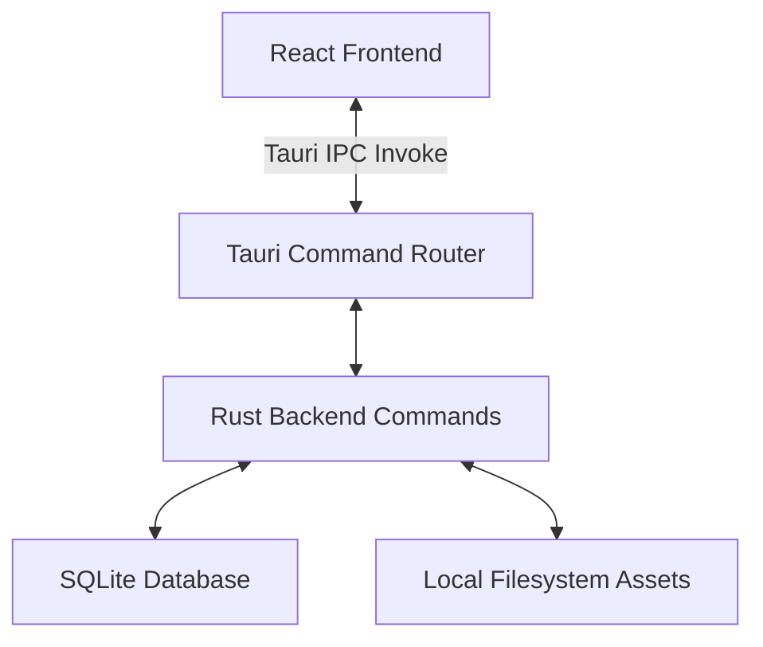

# Noetesy Note - Technical Implementation Overview

This document provides a comprehensive overview of how the **Noetesy Note** desktop application is implemented. The application is built using a modern desktop stack combining Rust, Tauri, React, TypeScript, and SQLite.

---

## 1. System Architecture

The application follows a standard desktop client-server hybrid model, leveraging **Tauri v2** to bridge the frontend user interface with the local system:



- **Frontend**: A single-page application (SPA) built using React, Vite, Tailwind CSS, and Zustand. It runs in a secure Webview context provided by Tauri.
- **Backend**: A Rust process that manages system integrations, executes SQLite database operations, handles filesystem events, and provides helper utilities like Markdown/JSON exports and asset managers.
- **IPC Layer**: Tauri's type-safe `invoke` mechanism enables the frontend to call Rust commands asynchronously.

---

## 2. Frontend Implementation

### 2.1 State Management (Zustand)
The application state is partitioned into two focused stores to maintain high responsiveness:
1. **`appStore.ts`**: Manages global UI/navigation state:
   - Sidebar navigation and layout (collapsing, custom width).
   - Selected workspace scopes (active folder and note contexts).
   - Global UI flags (search modal visibility, system-preferred dark/light theme).
   - Cached lists of notes, folders, and tags fetched from the database.
2. **`editorStore.ts`**: Manages the current editing session:
   - Active note content object and associated metadata.
   - List of tags assigned to the active note.
   - Autosave debounce state indicator (`isSaving`) and save confirmations.
   - Real-time word and character counts.

### 2.2 Rich-Text Editor (Tiptap)
The editor component (`Editor.tsx`) is built using **Tiptap**, a headless wrapper around ProseMirror:
- **Extensions**: Incorporates a rich suite of plugins including Highlight, CodeBlock (powered by `lowlight` and `highlight.js`), Underline, Link, Typography, Placeholder, TaskList, TaskItem, and Tables.
- **Autosave**: Changes are debounced and automatically pushed to the Rust backend using `noteUpdate` commands, preventing data loss.
- **Word Counter**: Listeners count words and characters in real-time on every content update.

### 2.3 UI & Design System
- **Styling**: Utilizes CSS styling combined with Tailwind CSS for modern layouts. It incorporates a customizable dark/light theme supporting system settings.
- **Iconography**: Uses `lucide-react` for simple, consistent UI controls.

---

## 3. Backend Implementation (Rust & Tauri)

The backend code is organized into modular Rust modules under `src-tauri/src`:

```
src-tauri/src/
├── main.rs           # Application Entrypoint
├── lib.rs            # Tauri Builder & Command Registration
├── db/               # SQLite Integration & Database Schema Setup
│   ├── mod.rs        # DB Connection Pooling & Migrations
│   └── migrations/   # SQL Schema Migration Scripts
└── commands/         # Core API Commands Called by Frontend
    ├── notes.rs      # CRUD Operations for Note Entries
    ├── folders.rs    # Folder Nesting & Organization
    ├── tags.rs       # Tag Management & Associations
    ├── search.rs     # SQLite FTS5 (Full-Text Search) Queries
    ├── assets.rs     # Image & Attachment Filesystem I/O
    └── export.rs     # Markdown & JSON Backup Engine
```

### 3.1 SQLite Database Layer
- **Connection**: Managed inside `db/mod.rs` using a thread-safe connection pool or direct single-instance handle.
- **Migrations**: Automated database schema migrations run at startup, creating tables for:
  - `notes`: Contains title, JSON representation of text, raw text (for search), folder association, trash status, and timestamps.
  - `folders`: Enables nested tree structures via parent folder references.
  - `tags`: Stores tags and custom hex colors.
  - `note_tags`: Junction table mapping notes to tags.
  - `assets`: Maps files stored in local directories to specific notes.

### 3.2 Command APIs
- **`notes.rs`**: Handles note creation, retrieval (`note_get`), list generation (`notes_list`), soft deletion/restoring, and toggling of favorite tags.
- **`folders.rs`**: Provides capabilities to create, rename, and recursively delete folder hierarchies.
- **`tags.rs`**: Manages tag creation and handles assign/remove actions linking tags to specific notes.
- **`search.rs`**: Implements global indexing via SQLite FTS5 to query matching phrases instantly across titles and raw note contents.
- **`assets.rs`**: Securely saves and reads embedded media attachments (images, PDFs) directly to a dedicated local directory inside the application's data directory.
- **`export.rs`**: Converts document structures into standard Markdown files or generates a unified JSON package containing all note archives for backups.

---

## 4. Key Workflows

### 4.1 Real-time Autosave Workflow
1. User types in Tiptap editor -> triggers `onUpdate`.
2. Editor counts characters/words and writes local state.
3. Debounced callback runs after a short delay (e.g., 800ms of inactivity).
4. Calls `noteUpdate` IPC function containing JSON content and raw text.
5. Rust handler writes data to SQLite, setting `updated_at = datetime('now')`.
6. UI sets state status back to "Saved".

### 4.2 Local Asset Management Workflow
1. User drags or pastes an image/file into the editor.
2. React frontend intercepts the event and reads the file as a byte array.
3. IPC executes `asset_save` command with raw byte data.
4. Rust backend saves file to the local sandbox folder and records it in the `assets` database.
5. Command returns a unique local URL (e.g., `asset://<id>`).
6. Editor inserts the custom URL as an image node source.

---

## 5. Security & System Integration

- **Sandboxing**: File I/O is restricted to Tauri app data folders.
- **IPC Safety**: Command inputs are validated using Rust pattern matching and strong typing.
- **Performance**: Heavy text search and database processing run in background threads, keeping the UI at 60 FPS.
